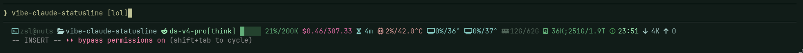

# Claude Code Statusline

动态状态栏，展示系统资源、会话信息、编辑指示器和提供商余额。

支持 Linux 和 macOS。

## 文件

| 文件 | 用途 |
|------|------|
| `statusline-command.sh` | 状态栏主脚本，渲染所有 segment |
| `edit-hook.sh` | PostToolUse hook，记录当前编辑的文件 |
| `balance-fetch.sh` | 拉取 DeepSeek 余额并缓存 |
| `settings-snippet.json` | settings.json 中需要添加的配置片段 |

## 安装

将三个 `.sh` 文件复制到 `~/.claude/`，将 `settings-snippet.json` 中的配置合并到 `~/.claude/settings.json`。

## macOS 注意事项

- CPU 温度：可选安装 `osx-cpu-temp` (`brew install osx-cpu-temp`)，不安装则只显示使用率
- GPU：需要安装 NVIDIA 驱动和 `nvidia-smi`（Mac 上较少见）
- 图标：需要终端支持 Nerd Font

## 状态栏 Segments

```
 user@host   cwd  (branch)[!]   model[think]  ██░░░ 55%/200K  5.01/308.62   1h40m   2%/43°C   0%/36°   3%/37°   11G/62G  󰋊 4.0K;220G/938G   29K   0  󱑅 23:30   (Edit) file.sh
```

从左到右：用户/主机、当前目录、git 分支/脏标记、模型名/thinking、上下文窗口使用(色条+百分比/总量)、成本/余额、会话时长、CPU使用/温度、GPU使用/温度、内存、磁盘、网络下行/上行、动态时钟图标+时间、最近编辑的文件(5s 后消失)。



## 动态时钟图标

使用 Nerd Font MDI `clock-time-X` 图标 (U+F1445~U+F1450)，最近整点四舍五入，12 小时制。

## 编辑指示器

- 绿色（Edit）、黄色（Write）、红色（删除类 Bash 命令）
- 显示 5 秒后自动消失
- 仅实际文件操作触发，无关命令不干扰
- 按 session_id 隔离，不会跨 Claude Code 实例串扰

## 余额显示

- 仅支持 DeepSeek 当前，预留扩展其他提供商
- 缓存 5 分钟，后台异步刷新，内部锁防并发
- 需设置 `DEEPSEEK_API_KEY` 环境变量

## 扩展余额提供商

在 `balance-fetch.sh` 中添加：

```bash
get_xxx_balance() {
    # 拉取逻辑
    echo "xxx|USD|123.45"
}

case "$provider" in
    deepseek) get_deepseek_balance ;;
    xxx)      get_xxx_balance ;;
esac
```
